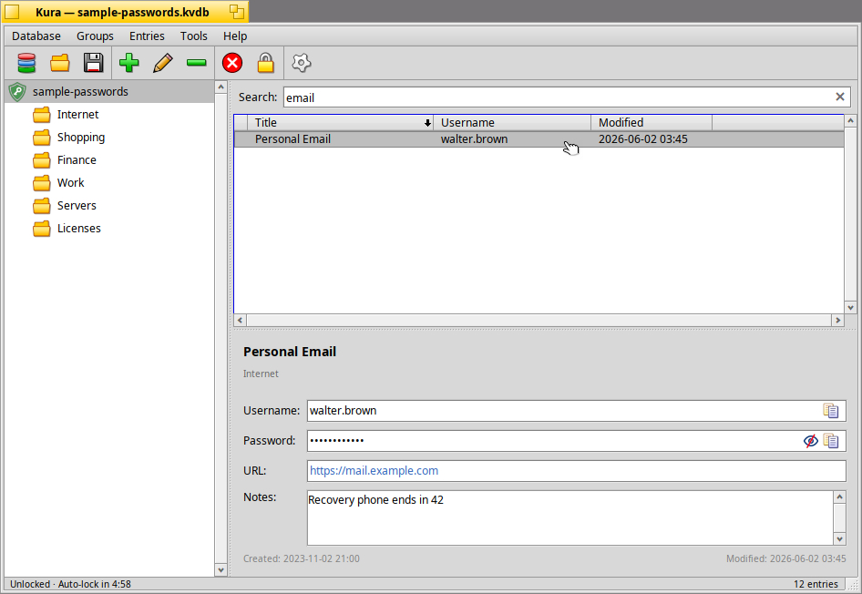

# Kura

**Kura** (蔵 — a traditional Japanese storehouse) is a native password
manager for the [Haiku](https://www.haiku-os.org/) operating system. It
keeps your usernames, passwords and related secrets in a single encrypted
database that only you can open, with a clean, native Haiku interface built
on the Be API.

> ⚠️ **Alpha software.** Kura is under active development (version 0.2
> alpha). It works and is usable day to day, but the on‑disk format may
> still change between versions. Keep independent backups of anything
> important, and don't rely on it as your sole store of critical
> credentials yet.

---



## Features

- **Encrypted local database** — your entries live in a single `.kvdb`
  file, encrypted with AES‑256‑GCM. The key is derived from your master
  password with PBKDF2‑HMAC‑SHA256, and the decrypted contents exist in
  memory only while the database is unlocked.
- **Groups in a tree** — organize entries into nested groups, shown in a
  KeePassXC‑style sidebar with folder icons. Drag entries onto a group to
  move them.
- **Entry details** — title, username, password, URL and notes, each with
  copy and reveal controls where appropriate.
- **Password generator** — cryptographically secure random passwords with a
  configurable character set and a live entropy estimate.
- **Live search** — filter entries as you type, with a clear button and
  <kbd>Alt</kbd>+<kbd>F</kbd> shortcut.
- **Auto‑lock** — locks after a configurable idle period, with a countdown
  in the status bar; also locks on minimize and re‑prompts on restore.
- **Clipboard protection** — copied usernames and passwords are cleared
  from the clipboard after a configurable delay (only Kura's own clipboard
  content is touched).
- **Import** — import from KeePass / KeePassXC CSV exports, preserving your
  group hierarchy.
- **Recent files, atomic saves and optional `.bak` backups** — saves are
  written atomically (temp file + rename) so a crash or full disk can't
  corrupt your database; an optional backup keeps the previous version.
- **Settings** — clipboard‑clear delay, auto‑lock timeout, lock on
  minimize, automatic save on lock, and backups, all configurable.

---

## Security notes

Kura aims to follow sound, conventional practice for a local password
store:

- **Cipher:** AES‑256‑GCM (authenticated encryption) via OpenSSL.
- **Key derivation:** PBKDF2‑HMAC‑SHA256 from your master password.
- **At rest:** only the encrypted `.kvdb` file is written to disk. The
  plaintext database is held in memory solely while unlocked, and is
  scrubbed from memory on lock.
- **Clipboard:** timed clearing of copied secrets, scoped to Kura's own
  clipboard content.

That said, Kura is young alpha software and has **not** undergone a formal
security audit. It also can't protect against threats outside its scope —
for example, a compromised machine or another local process capturing your
master password as you type it. Use it with appropriate expectations, and
keep backups.

---

## Building

Kura is built with the standard Haiku build tools on Haiku itself.

### Requirements

- Haiku (x86_64, GCC‑based `x86_64` architecture)
- The default Haiku development tools (`make`, `gcc`)
- OpenSSL development headers (part of the Haiku base system)

### Build

```sh
make
```

This produces the `Kura` application in the build objects directory. The
`Makefile` uses Haiku's `makefile-engine` and links against the standard
Haiku kits plus `libcrypto`/`libssl` (OpenSSL), `libshared`,
`libcolumnlistview` and `liblocalestub`.

To run it from the build directory:

```sh
./objects.*-cc*-release/Kura      # release build
./objects.*-cc*-debug/Kura        # debug build
```

---

## Usage

- **First run** — Kura opens with no database. Use **Database ▸ New** to
  create one; you'll be asked to set a master password.
- **Opening** — **Database ▸ Open**, or pick from **Open recent**. On
  launch Kura offers to unlock your most recently used database if it still
  exists.
- **Adding entries** — use the toolbar's **Add** button or the **Entries**
  menu. Organize them into groups from the **Groups** menu, and drag
  entries between groups in the sidebar.
- **Copying credentials** — use the copy buttons next to each field; the
  clipboard is cleared automatically after the delay set in **Settings**.
- **Locking** — Kura locks automatically when idle or minimized, or
  manually with the **Lock** toolbar button. When locked, the database
  contents are removed from memory until you unlock again.
- **Importing** — **Database ▸ Import** accepts KeePass / KeePassXC CSV
  exports.

Databases are stored wherever you choose to save them as `.kvdb` files.
Application settings (window layout, options, recent files) are kept as a
Haiku settings message in `~/config/settings/Kura/`.

---

## Project layout

The source lives under `src/`. Broadly:

| Area | Files |
| --- | --- |
| Application & main window | `KuraApp`, `KuraWindow` |
| Data model & persistence | `KuraDatabase`, `KuraCrypto`, `KuraSettings`, `KuraCsvImport` |
| Views | `GroupListView`, `EntryListView`, `DetailView`, `FieldView`, `StatusBar`, `SearchTextControl` |
| Dialogs | `UnlockWindow`, `EntryEditWindow`, `GroupEditWindow`, `SettingsWindow`, `PasswordGeneratorWindow`, `AboutWindow` |
| Support | `KuraClipboard`, `KuraUtils.h`, `KuraDefs.h`, `Kura.rdef` |

---

## Status & roadmap

Kura is at **0.2 alpha**. Implemented and working: encrypted database,
groups, entry management, password generator, search, auto‑lock, clipboard
clearing, CSV import, settings, toolbar and drag‑and‑drop.

Planned / under consideration:

- Custom fields per entry (arbitrary named, optionally protected fields)
- CSV export
- Group re‑parenting via drag
- Localization (Haiku Locale Kit)
- Selection‑aware toolbar actions

---

## License

Distributed under the terms of the **MIT License**.

Copyright © 2026 Il Felice.

Created with the assistance of AI tools.

---

## Acknowledgements

- **[Haiku](https://www.haiku-os.org/)** — for the operating system and its
  API.
- **[OpenSSL](https://www.openssl.org/)** — for the cryptographic
  primitives.
- **[KeePass](https://keepass.info/) / [KeePassXC](https://keepassxc.org/)**
  — as sources of inspiration and for CSV import compatibility.
